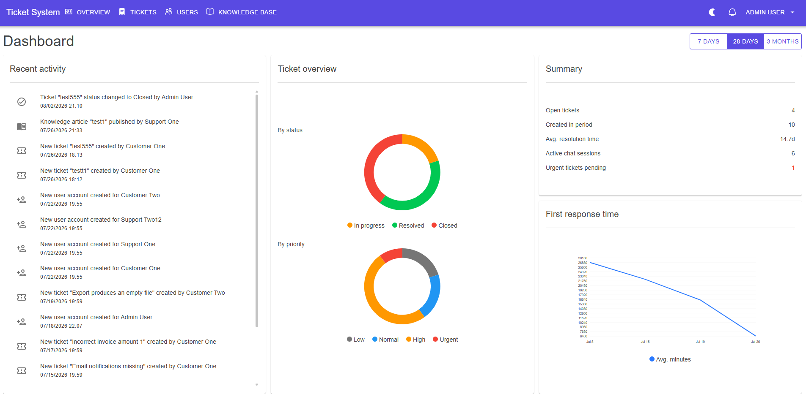
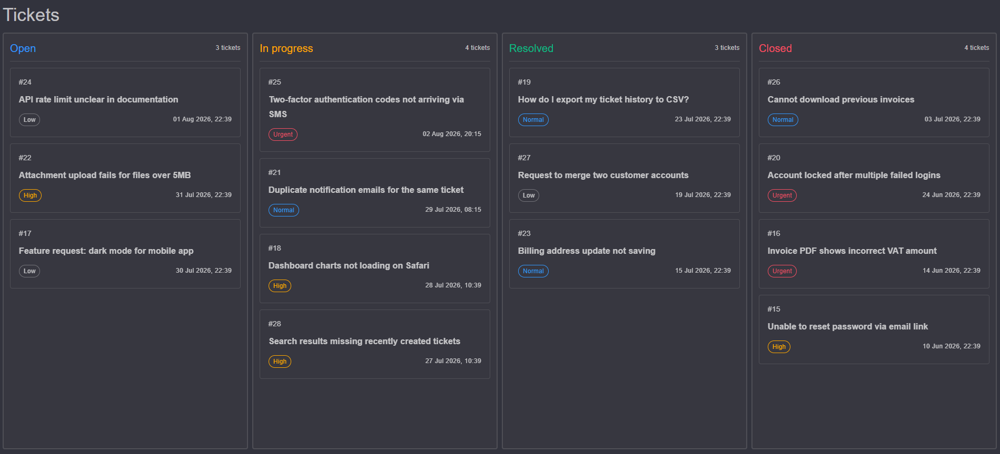
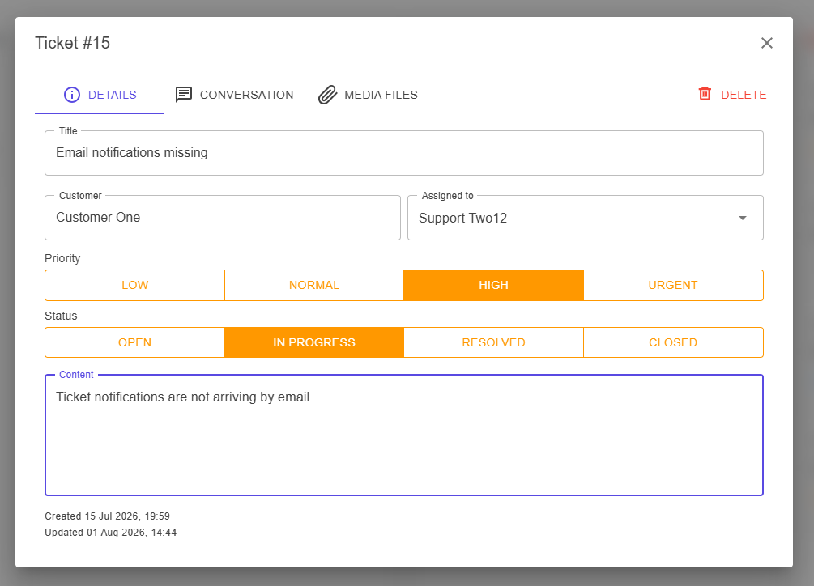

# Ticket System

A full-stack support ticket platform: a kanban-style ticket board, live per-ticket chat with file attachments, a knowledge base, and an analytics dashboard — built with Blazor Server, ASP.NET Core, PostgreSQL, and SignalR.

## Screenshots

**Dashboard** — status/priority breakdown, first-response-time trend, and a live recent-activity feed.



**Ticket board** — drag-and-drop kanban view grouped by status, with priority and age at a glance.



**Ticket detail** — details, live chat, and attachments in one dialog.



## Features

- **Kanban ticket board** with drag-and-drop status changes, filtered by priority
- **Live chat per ticket** over SignalR, with file attachments and a full media library per conversation
- **Analytics dashboard** — ticket status/priority breakdown, first-response-time trend, recent activity feed, configurable date range
- **Knowledge base** with draft / published / archived article workflow
- **Role-based access** — Administrator, Operator, and Customer, each scoped to what they need
- **Dark mode**

## Tech stack

- **Web**: Blazor Server (.NET 8) with MudBlazor
- **API**: ASP.NET Core minimal APIs
- **Realtime**: standalone JWT-secured SignalR host
- **Database**: PostgreSQL, with hand-written ordered SQL migrations (no ORM)

## Getting started

Run the full stack with Docker:

```powershell
Copy-Item deploy/.env.example deploy/.env
docker compose --env-file deploy/.env -f deploy/compose.yaml up -d --build
```

Open `http://localhost:8180` and sign in with one of the seed accounts:

| Role | Email | Password |
| --- | --- | --- |
| Administrator | `admin@ticketsystem.local` | `ChangeMe123!` |
| Operator | `operator@ticketsystem.local` | `ChangeMe123!` |
| Customer | `customer@ticketsystem.local` | `ChangeMe123!` |

Change or remove these before any public deployment. To populate the board with realistic demo tickets like the screenshots above, run [`test-data.sql`](test-data.sql) against the database afterward.

See [`deploy/README.md`](deploy/README.md) for the full Docker reference: environment variables, Web hot reload, individual service rebuilds, and resetting the database.

### Visual Studio

Open `TicketSystem.sln` in Visual Studio 2022 and select the `TicketSystem Web + Realtime` launch profile. Starting that profile launches both projects:

- `TicketSystem.Web` on `https://localhost:7097` and `http://localhost:5047`.
- `TicketSystem.Realtime` on `https://localhost:7197` and `http://localhost:5057`.

The SignalR hub URLs are:

```text
https://localhost:7197/hubs/chat
https://localhost:7197/hubs/tickets
https://localhost:7197/hubs/app-users
https://localhost:7197/hubs/knowledge
```

## Files

- `TicketSystem.sln` - Visual Studio solution file for the application.
- `src/TicketSystem.Api` - ASP.NET Core HTTP API that applies pending database migrations during startup.
- `src/TicketSystem.DAL/Database/DatabaseMigrations.cs` - ordered PostgreSQL schema migrations.
- `schema.sql` - standalone mirror of the current schema after all migrations for creating or inspecting an empty database.
- `test-data.sql` - optional showcase seed data (demo tickets, chat history, knowledge articles).
- `src/TicketSystem.Shared` - DTOs and enums shared by the API and Web projects.
- `global.json` - pins the local SDK to .NET 8 for Visual Studio 2022 compatibility.
- `src/TicketSystem.Web` - Blazor Web App project configured for MudBlazor and server interactivity.
- `src/TicketSystem.Realtime` - standalone authenticated SignalR host for application notifications.
- `TicketSystem.slnLaunch` - Visual Studio multi-project launch profile for starting Web and Realtime together.
- `deploy/README.md` - Docker configuration, standard startup, Web hot reload, and container operations.

## Application Stack

The generated solution currently targets `net8.0` because this machine has .NET 8 installed and it is the safest option for Visual Studio 2022 compatibility. MudBlazor 9.x supports .NET 8, .NET 9, and .NET 10, so the project can be upgraded later when the target development environment has a compatible SDK installed.

Current setup:

- `TicketSystem.Web` is a Blazor Web App with interactive server components.
- `TicketSystem.Web` references `MudBlazor` version `9.6.0`.
- `TicketSystem.Web` runs as the MudBlazor application.
- `TicketSystem.Realtime` owns the authenticated AppUser, Chat, Knowledge, and Ticket SignalR hubs.
- `TicketSystem.Api` persists changes and publishes ID-only notifications to Realtime through a protected internal endpoint.
- Connected Web pages receive the notification and fetch authorized data through the API.

## Data Model

### AppUser

The `AppUser` table stores all customers, operators, and administrators. There is no separate `Customer` table; a customer is an `AppUser` whose `UserTypeId` is `1`.

- `Id` is a `uuid` primary key.
- `Email` is unique.
- `PasswordHash` stores the hashed password. Never store a plain-text password.
- `UserTypeId` identifies whether the user is a customer, operator, or administrator.
- `CreatedAt` and `UpdatedAt` store audit timestamps.
- `UpdatedByUserId` identifies the administrator responsible for the latest change and references `AppUser.Id`.

### Lookup tables

Normalized status, priority, and category values are stored in lookup tables:

- `ChatSessionStatus` contains `Id`, `Code`, and `Name`; its codes are `active` and `closed`.
- `TicketStatus` contains `Id`, `Code`, and `Name`; its codes are `open`, `in_progress`, `resolved`, and `closed`.
- `TicketPriority` contains `Id`, `Code`, `Name`, and `SortOrder`; its codes are `low`, `normal`, `high`, and `urgent`.
- `KnowledgeStatus` contains `Id`, `Code`, and `Name`; its codes are `draft`, `published`, and `archived`.
- `KnowledgeCategory` contains `Id` and a unique `Name`.

### ChatSession

The `ChatSession` table represents a conversation between a customer and an operator.

- `CustomerId` identifies the customer who started the conversation and references `AppUser.Id`.
- `OperatorId` identifies the operator who accepted the conversation and references `AppUser.Id`. It can be `NULL` until the conversation is assigned.
- `Title` is an optional conversation title.
- `StatusId` references `ChatSessionStatus.Id`.
- `CreatedAt` stores the creation time, while `ClosedAt` is set when the conversation is closed.

A chat session is a good boundary for a SignalR room/group. When a customer and operator connect through SignalR, they can be added to a group named, for example, `chat-session:{chatSessionId}`.

### Ticket

The `Ticket` table represents a concrete support request.

- `Id` is a `uuid` primary key.
- `TicketNumber` is an auto-incrementing business number that is useful for displaying tickets to users.
- `ChatSessionId` optionally links the ticket to `ChatSession.Id` after the first message creates a chat session.
- `CustomerId` identifies the customer who opened the ticket and references `AppUser.Id`.
- `OperatorId` identifies the assigned operator and references `AppUser.Id`.
- `Title` and `Content` store the request title and initial problem description.
- `StatusId` references `TicketStatus.Id`.
- `PriorityId` references `TicketPriority.Id`.
- `CreatedAt`, `UpdatedAt`, and nullable `ClosedAt` store lifecycle timestamps.
- `IsDeleted` marks a ticket as soft-deleted without removing its data.
- `UpdatedByUserId` identifies the user responsible for the latest change and references `AppUser.Id`.

In the simple flow, one ticket has one chat session. If multiple conversations are needed for the same ticket later, the relationship can be adjusted so that `ChatSession` contains a `TicketId` reference.

### TicketStatusHistory

The `TicketStatusHistory` table records every status transition a ticket goes through, driving the dashboard's recent-activity feed.

- `TicketId` references the ticket that changed and references `Ticket.Id`.
- `OldStatusId` and `NewStatusId` reference `TicketStatus.Id`.
- `ChangedByUserId` identifies who made the change and references `AppUser.Id`.
- `ChangedAt` stores when the change happened.

### Message

The `Message` table stores chat history.

- `ChatSessionId` is required because every message belongs to a conversation.
- `TicketId` is optional, but useful when loading all messages for a ticket.
- `SenderId` identifies the customer or operator who sent the message.
- `Content` is the message body.
- `SentAt` stores the send time.

### MessageRead

The `MessageRead` table stores per-user read receipts.

- `MessageId` identifies the message that was read.
- `UserId` identifies the user who read the message.
- `ReadAt` stores the read time.

This is more flexible than a single read flag on `Message`, because the same conversation can be read by a customer, an operator, and an administrator.

### MediaFile

The `MediaFile` table stores file attachments shared in a chat session.

- `ChatSessionId` identifies the conversation the file was shared in and references `ChatSession.Id`.
- `UploadedByUserId` identifies who uploaded the file and references `AppUser.Id`.
- `Name`, `Extension`, and `ContentType` describe the file.
- `SizeBytes` and `Content` store the size and raw bytes; a size constraint caps attachments at 10 MB.
- `CreatedAt` stores the upload time.

### Knowledge

The `Knowledge` table stores knowledge-base articles.

- `Title` and `Content` store the article contents.
- `CategoryId` optionally references `KnowledgeCategory.Id`.
- `StatusId` references `KnowledgeStatus.Id`.
- `AuthorId` references the author in `AppUser.Id`.
- `CreatedAt`, `UpdatedAt`, and nullable `PublishedAt` store lifecycle timestamps.

## Suggested Flow

1. A customer or technician creates a `Ticket` record without a chat session.
2. The first message creates a `ChatSession` and links it to the ticket through `ChatSessionId`.
3. The first message is stored as a `Message` with the same `ChatSessionId` and `TicketId`.
4. SignalR sends messages to the group connected to `ChatSessionId`.
5. Every sent message is stored in `Message`, so the chat history can be loaded from the database.
6. When a customer or operator opens the conversation, the application inserts rows into `MessageRead` for the seen messages.

## Database migrations

The API applies pending migrations from `DatabaseMigrations.All` during startup and records every applied version in the `DatabaseVersion` table. The root `schema.sql` file mirrors the complete current schema and can also be used to create an empty database manually. Both definitions must remain synchronized. See [`deploy/README.md`](deploy/README.md) for the container startup workflow.
